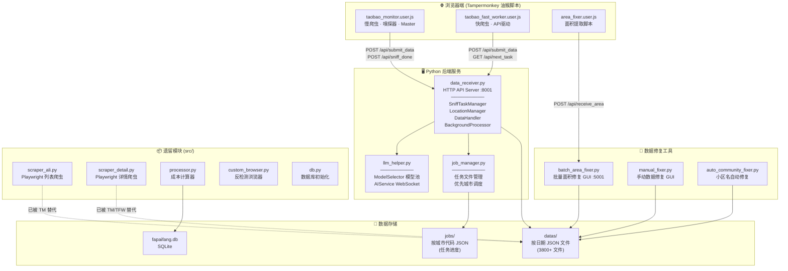
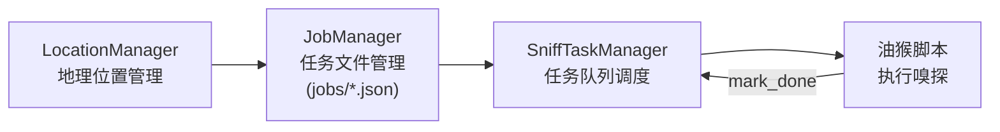
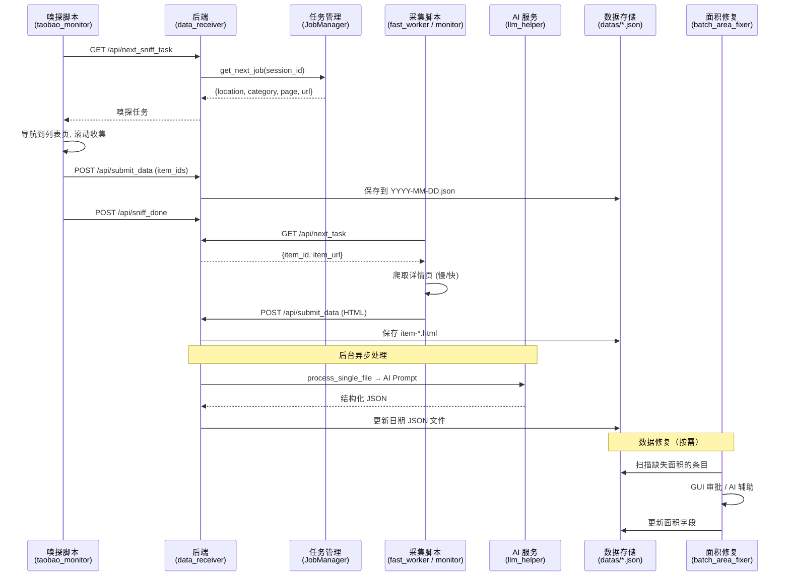

# 法拍房数据采集与分析系统 — 架构文档

> 最后更新: 2026-02-10

---

## 一、系统概览

本系统的目标是采集全中国淘宝司法拍卖平台的法拍房数据，通过 AI 模型提取结构化信息，并对数据进行修复和增值处理。

系统采用**浏览器油猴脚本 + Python 后端**的协作架构，前端（Tampermonkey 脚本）负责在真实浏览器环境中完成爬取，后端（Python HTTP 服务）负责任务调度、数据存储和 AI 分析。

---

## 二、系统架构图



---

## 三、子系统详解

### 子系统 A：数据采集（爬虫系统）

数据采集分为两个阶段：**URL 发现**（嗅探）和**详情页采集**。

#### A1. URL 发现（列表页嗅探）

| 属性 | 说明 |
|------|------|
| **前端** | `taobao_monitor.user.js` 中的嗅探模式 (`masterLoop`) |
| **后端** | `SniffTaskManager` + `JobManager` |
| **方式** | 慢爬虫（界面驱动），滚动列表页收集商品 URL |
| **存储** | 商品 ID 写入 `datas/` 下的日期 JSON 文件 |
| **特点** | 支持多位置并发、断点续爬、83页自动扩展排序参数 |

**数据流：**
```
后端分配嗅探任务 (location + category + page)
    → 油猴脚本导航到列表页
    → 滚动加载所有商品
    → 提取 item_id + item_url
    → POST /api/submit_data 发送到后端
    → 后端保存到 datas/YYYY-MM-DD.json
    → POST /api/sniff_done 标记页面完成
```

#### A2. 详情页采集

提供两种策略，可根据场景切换：

##### 慢爬虫（界面驱动） — `taobao_monitor.user.js`

```
后端分配待爬 URL → Master 开新标签页 → 等待页面加载完成
→ cleanHTML() 过滤 DOM → POST /api/submit_data → 关闭标签页
```

- **适用性**：通用，任何网页结构
- **并发**：受标签页数限制（约2-3个并发）
- **速度**：~7 URL/分钟
- **可靠性**：高（完整 DOM）

##### 快爬虫（API 驱动） — `taobao_fast_worker.user.js`

```
后端分配批量 URL(BATCH_SIZE=20) → 并发 HTTP 请求(CONCURRENCY=5)
→ Step1: fetchDetailPage() 提取 project_id + J_desc URL
→ Step2: fetchNoticeDetail() 调淘宝内部 API 获取公告数据
→ Step2b: fetchDescContent() 获取标的物描述
→ Step3: buildAndSendContent() 拼装等效 HTML → POST /api/submit_data
```

- **适用性**：**仅限淘宝司法拍卖**（高度定制化）
- **并发**：5 个并行 HTTP 请求，无需开标签页
- **速度**：比慢爬虫快 5-10 倍
- **可靠性**：依赖淘宝 API 结构不变

---

### 子系统 B：任务调度（编排系统）

任务调度是整个系统的中枢，负责协调前端爬虫和后端处理之间的工作流。

#### B1. HTTP API 服务 — `data_receiver.py` (`DataHandler`)

运行在端口 **8001**，提供以下 API：

| 端点 | 方法 | 功能 |
|------|------|------|
| `/api/next_task` | GET | 分配下一个待爬详情页 URL |
| `/api/next_sniff_task` | GET | 分配下一个嗅探任务 |
| `/api/submit_data` | POST | 接收爬取的 HTML/数据 |
| `/api/sniff_done` | POST | 标记嗅探页面完成 |
| `/api/heartbeat` | POST | 前端心跳保活 |
| `/api/status` | GET | 当前系统状态 |
| `/api/approve_area` | POST | 面积修复审批 |

#### B2. 嗅探任务管理 — `SniffTaskManager` + `JobManager`



- **LocationManager**：管理全国地区代码，支持优先城市配置
- **JobManager**：每个城市一个 JSON 文件，跟踪每个 (城市, 类别, 排序参数) 的分页进度
- **SniffTaskManager**：维护任务队列，支持多会话并发、断点续爬、密集区域自动扩展

#### B3. 服务保活 — Watchdog

```python
# 10 分钟无请求 → 自动重启 Edge 浏览器带恢复 URL
WATCHDOG_TIMEOUT = 10 * 60
```

#### B4. 启动脚本 — `auto/`

| 脚本 | 功能 |
|------|------|
| `3-数据接收.bat` | 启动 `data_receiver.py` 后端 |
| `5-批量面积修复.bat` | 启动 `batch_area_fixer.py` 面积修复 |
| `4-系统防休眠.bat` | 阻止系统休眠 |
| `1-面积重写.bat` | 面积数据重写 |
| `2-小区改名.bat` | 小区名称修正 |

---

### 子系统 C：AI 分析（数据处理系统）

#### C1. 模型池管理 — `llm_helper.py`

```
ModelSelector
├── GLM-4.7-Base (讯飞星火 WebSocket API)
├── GLM-4.7-Base-2 (第二实例)
└── ... (可扩展)

功能：
- 并发槽位管理 (acquire/release)
- 运行时动态调整并发限制
- 按任务类型路由模型
- 错误率统计与配置持久化
```

#### C2. 后台处理流程 — `data_receiver.py`

```
DATAS 目录
  ├── item-*.txt / item-*.html (待处理原始文件)
  │
  └── background_file_processor() ← 每3秒检查
        │
        ├── process_single_file()
        │     ├── 读取 HTML 内容
        │     ├── 构建 AI Prompt
        │     ├── AIService.get_response() → 讯飞星火 API
        │     ├── 解析 AI 返回的 JSON
        │     └── update_item_in_json() → 写入日期 JSON 文件
        │
        └── ThreadPoolExecutor (并发受 ModelSelector 限流)
```

#### C3. 自动调优 — `auto_tune_concurrency.py`

每 5 分钟分析 API 成功率和并发错误率，自动调整模型并发限额。

---

### 子系统 D：数据修复（后处理系统）

用于修复 AI 分析遗漏或错误的字段（主要是建筑面积）。

| 工具 | 文件 | 端口 | 功能 |
|------|------|------|------|
| 批量面积修复 | `batch_area_fixer.py` + `area_fixer.user.js` | 5001 | Tkinter GUI + 油猴脚本协作，自动/手动提取面积 |
| 手动数据修复 | `manual_fixer.py` | - | Tkinter GUI，逐条修复缺失字段 |
| 小区名修复 | `auto_community_fixer.py` | - | AI 驱动的小区名标准化 |

---

### 子系统 E：遗留模块 (`src/`)

这些是项目早期开发的模块，功能已被 `tb_adapter/` 中的实现替代：

| 文件 | 原功能 | 现状 |
|------|--------|------|
| `scraper_ali.py` | Playwright 驱动的列表页爬虫 | 已被 `taobao_monitor.user.js` 嗅探替代 |
| `scraper_detail.py` | Playwright 驱动的详情页爬虫 | 已被慢/快爬虫替代 |
| `processor.py` | 成本计算器 | 可复用，暂时未活跃调用 |
| `custom_browser.py` | 反检测浏览器会话 | 仅 `scraper_ali.py` 使用 |
| `db.py` | SQLite 初始化 | 被 JSON 文件存储替代 |
| `query.py` | 估值查询 | 暂时未活跃调用 |

> ⚠️ `main.py`（根目录）是这些遗留模块的入口，编排 `AliScraper → DetailScraper → Processor` 流程。

---

## 四、数据流全景



---

## 五、文件清单与归属

### 活跃核心文件

| 子系统 | 文件 | 行数 | 职责 |
|--------|------|------|------|
| **采集-慢** | `tb_adapter/taobao_monitor.user.js` | 1205 | 慢爬虫 + 嗅探器 + Master |
| **采集-快** | `tb_adapter/taobao_fast_worker.user.js` | 576 | API 驱动快爬虫 |
| **调度** | `tb_adapter/data_receiver.py` | 2226 | 后端核心服务 |
| **AI** | `tb_adapter/llm_helper.py` | 634 | AI 模型池管理 |
| **任务** | `jobs/job_manager.py` | 627 | 嗅探任务管理 |
| **修复** | `batch_area_fixer.py` | 1014 | 批量面积修复 GUI |
| **修复** | `tb_adapter/area_fixer.user.js` | 410 | 面积提取油猴脚本 |
| **修复** | `manual_fixer.py` | 340 | 手动数据修复 GUI |
| **修复** | `auto_community_fixer.py` | ~200 | 小区名自动修复 |
| **调优** | `auto_tune_concurrency.py` | 212 | AI 并发自动调优 |
| **工具** | `extract_notice_text.py` | 56 | 公告文本提取 |
| **保活** | `keep_awake.py` | ~60 | 系统防休眠 |

### 调试/检查脚本（可归档）

| 文件 | 用途 |
|------|------|
| `analyze_data_quality.py` | 数据质量分析 |
| `analyze_failed_html.py` | 失败 HTML 分析 |
| `debug_missing_ids.py` | 缺失 ID 调试 |
| `inspect_db_*.py` | 数据库检查系列 |
| `inspect_valid_data.py` | 有效数据检查 |
| `test_*.py` | 测试脚本系列 |
| `clean_locations.py` | 位置数据清理 |
| `cleanup_sniff_done.py` | 嗅探完成文件清理 |

---

## 六、当前架构总结

### 系统优势

1. **双模爬虫策略**：慢爬虫保证通用性和容错，快爬虫提供速度
2. **完善的断点续爬**：嗅探任务有完整的进度持久化和恢复机制
3. **AI 并发池管理**：支持多模型、动态调优、运行时调整
4. **全国覆盖调度**：`LocationManager` + `JobManager` 支持按城市优先级全国扫描
5. **数据修复闭环**：自动 + 半自动 + 手动三级修复体系

### 可改进方向

1. **`data_receiver.py` 过于庞大**（2226行）：集中了调度、API、数据处理等多重职责
2. **遗留模块未清理**：`src/` 下的模块大部分已不活跃
3. **辅助脚本散落**：调试/检查/测试脚本散布在根目录
