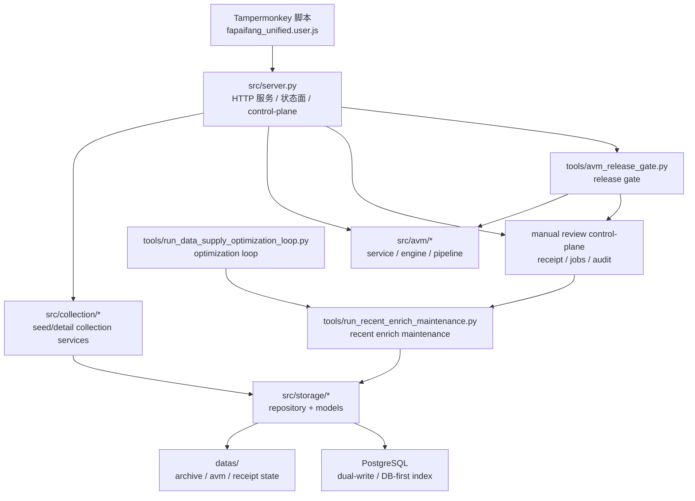

# 法拍房采集与 AVM 系统 — 当前实现架构

> 最后更新：2026-05-15
> 本文档描述 **当前仓库已经实现的工程结构与数据/控制流**。
> 如果你需要看 AVM 的长期目标蓝图，请阅读 `docs/AVM_Architecture_Overview.md`。

---

## 1. 系统概览

当前系统已经不再只是“抓网页 + 落 JSON”的单链路，而是由四层能力组成：

1. **Collection**：浏览器脚本 + Python HTTP 服务，完成搜索、详情抓取与归档。
2. **Storage / Index**：JSON 归档 + PostgreSQL dual-write / DB-first 索引。
3. **AVM / Analysis**：Canonical、feature、evaluate、alert、release gate 工具链。
4. **Operator control-plane**：manual review receipt、async maintenance job、audit log、status/gate 观察面。

当前主入口：

- 服务入口：`src/server.py`
- 采集脚本：`tampermonkey_scripts/fapaifang_unified.user.js`
- 维护工具：
  - `tools/run_recent_enrich_maintenance.py`
  - `tools/run_data_supply_optimization_loop.py`
  - `tools/avm_release_gate.py`

---

## 2. 顶层组件

```mermaid
graph TD
    TM["Tampermonkey 脚本<br/>fapaifang_unified.user.js"]
    API["src/server.py<br/>HTTP 服务 / 状态面 / control-plane"]
    COL["src/collection/*<br/>seed/detail collection services"]
    STORE["src/storage/*<br/>repository + models"]
    JSON["datas/<br/>archive / avm / receipt state"]
    DB["PostgreSQL<br/>dual-write / DB-first index"]
    AVM["src/avm/*<br/>service / engine / pipeline"]
    MAINT["tools/run_recent_enrich_maintenance.py<br/>recent enrich maintenance"]
    LOOP["tools/run_data_supply_optimization_loop.py<br/>optimization loop"]
    GATE["tools/avm_release_gate.py<br/>release gate"]
    RECEIPT["manual review control-plane<br/>receipt / jobs / audit"]

    TM --> API
    API --> COL
    COL --> STORE
    STORE --> JSON
    STORE --> DB
    API --> AVM
    API --> RECEIPT
    RECEIPT --> MAINT
    MAINT --> STORE
    LOOP --> MAINT
    GATE --> AVM
    GATE --> RECEIPT
    API --> GATE
```

---

## 3. Collection 层

### 3.1 浏览器侧

浏览器侧仍然是现网采集入口：

- `tampermonkey_scripts/fapaifang_unified.user.js`

主要职责：

- 搜索/列表页嗅探
- 详情页抓取与回传
- 向后端上报进度、数据和状态

### 3.2 后端采集服务

后端采集逻辑已经从“单个超大脚本里的散乱流程”逐步收进 collection services：

- `src/collection/seed_service.py`
- `src/collection/detail_service.py`
- `src/collection/search_bootstrap.py`
- `src/collection/stage_state.py`

它们负责：

- 搜索任务调度
- 详情 pending task 管理
- HTML / payload / working item 提交
- stage status 推导与更新

### 3.3 主 HTTP 服务

`src/server.py` 当前承担：

- collection API
- status / health surface
- AVM 接口
- maintenance / pipeline 触发
- manual review control-plane

这是当前系统的统一外部入口。

---

## 4. Storage / Index 层

### 4.1 JSON 归档

JSON 仍然保留，主要用于：

- 历史原始数据归档
- HTML / payload / 附件路径
- 离线回放与审计
- 部分本地无 DB 场景运行

典型目录：

- `datas/archive/`
- `datas/avm/`

### 4.2 PostgreSQL / DB-first

当前已支持：

- dual-write
- DB-first pending task 读取
- stage / readiness / search task 统计

关键实现：

- `src/storage/models.py`
- `src/storage/repository.py`

系统当前策略是：

> **JSON 负责归档与文件型证据，DB 负责主索引、pending 状态、stage/readiness 统计。**

---

## 5. AVM / Analysis 层

### 5.1 在线服务

`src/avm/` 当前包括：

- `service.py`
- `engine.py`
- `pipeline.py`
- `schema.py`
- `risk_schema.py`
- `canonical_mapper.py`
- `feature_builder.py`
- `collection_template.py`
- `quality.py`

在线接口集中由 `src/server.py` 对外暴露。

### 5.2 离线工具链

分析侧工具主要位于 `tools/`：

- `build_canonical_dataset.py`
- `check_feature_drift.py`
- `evaluate_avm.py`
- `generate_avm_alerts.py`
- `avm_release_gate.py`
- `avm_data_loader.py`

这层负责：

- Canonical 数据构建
- 漂移检查
- 离线评估
- 告警生成
- 发布门禁

### 5.3 analysis-ready / collection-stage

当前系统的一个核心抽象是：

- **collection-stage**
- **analysis-ready**

相关状态汇总会在：

- `/api/status`
- `/api/avm/health`
- `/api/analysis/health`
- `tools/avm_release_gate.py`

中统一暴露。

---

## 6. Maintenance 与自动恢复层

### 6.1 recent enrich maintenance

主要入口：

- `tools/run_recent_enrich_maintenance.py`

负责统一编排以下动作：

- detail archive fetch
- archived detail backfill
- recent coordinate backfill
- detail replay preparation
- analysis ready recheck
- stage state reconcile

### 6.2 optimization loop

主要入口：

- `tools/run_data_supply_optimization_loop.py`

职责：

- 多轮运行 maintenance
- 汇总 action effectiveness
- 根据 handoff lifecycle 决定继续、等待、停止

### 6.3 shared planning

核心 planner：

- `tools/analysis_stage_planner.py`

它统一生成：

- `recommended_actions`
- `recoverability_summary`
- `manual_review_backlog_summary`
- `manual_review_receipt_summary`
- `manual_review_reentry_application_summary`
- `operator_overview`
- `scheduler_feedback_summary`

当前这些语义已经不只在 maintenance 里使用，也被：

- status
- health
- release gate
- optimization loop

共同复用。

---

## 7. Manual review control-plane

这是当前系统区别于旧版“只会抓数据”的最重要新增层之一。

### 7.1 三类状态文件

当前 control-plane 已进入 **DB-backed first phase**：

- repository enabled 时，当前 receipt / jobs / audit 会优先持久化到数据库
- repository disabled 时，仍回退到本地文件：
  - `datas/avm/manual_review_receipts.json`
  - `datas/avm/manual_review_receipt_jobs.json`
  - `datas/avm/manual_review_receipt_operations.jsonl`

### 7.2 代码组件

- `tools/manual_review_receipt_store.py`
- `tools/manual_review_receipt_jobs.py`
- `tools/manual_review_receipt_audit.py`

### 7.3 对外接口

当前 operator-facing 接口包括：

- `GET/POST/DELETE /api/avm/manual_review_receipts`
- `GET /api/avm/manual_review_receipt_jobs`
- `GET /api/avm/manual_review_receipt_operations`

以及 `analysis` 前缀别名。

### 7.4 语义层

control-plane 当前已经支持：

- receipt validation
- invalid taxonomy
- repair hints
- async maintenance jobs
- operation audit trail
- status / gate summaries

因此它已经不是“手改 JSON 文件”的脚手架，而是一个实际可用的 operator control-plane。

---

## 8. 状态面与发布面

### 8.1 在线状态面

由 `src/server.py` 提供：

- `/api/status`
- `/api/avm/health`
- `/api/analysis/health`

这些接口会统一暴露：

- collection-stage
- analysis blockers
- recommended actions
- receipt summary
- reentry summary
- job summary
- operation summary
- operator overview

### 8.2 发布门禁

由：

- `tools/avm_release_gate.py`

负责发布前的：

- readiness snapshot
- drift
- eval
- smoke
- receipt / handoff surface

它不是独立语义体系，而是尽量复用 shared planner 和 shared summaries。

---

## 9. 当前实现与目标蓝图的关系

当前仓库里有两类文档：

1. **当前实现文档**
   - `README.md`
   - `architecture.md`
   - `docs/AVM_API.md`
   - `docs/AVM_Runbook.md`

2. **目标蓝图文档**
   - `docs/AVM_Architecture_Overview.md`
   - `docs/analysis/final-collection-contract.md`
   - `docs/analysis/final-collection-template.json`

理解方式应该是：

- 当前实现文档回答：**现在代码真实是什么**
- 目标蓝图文档回答：**系统最终准备收口成什么**

不要把蓝图文档误当成“所有能力已经上线”的事实描述。

---

## 10. 当前主要边界与下一步方向

### 当前边界

- receipt / jobs / audit 已进入 DB-backed first phase，但仍保留 JSON fallback 与旧状态文件兼容层
- live DB migration 与 alembic 不是默认路径
- 一些历史采集叙事仍留在老文档和旧脚本心智里，正在逐步对齐

### 当前最稳定的主线

如果你要继续接手开发，建议默认沿下面这条主线理解系统：

> **Collection -> DB-first stage tracking -> analysis-ready / AVM -> maintenance / recovery -> manual review control-plane -> status / gate**

这条线最符合当前代码的真实中心。
