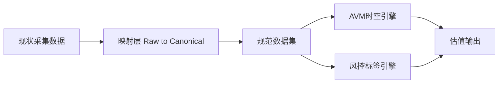

# 法拍房时空估价引擎 (AVM) 架构与实现蓝图

**此文档旨在为其他参与开发的 AI Agent 或工程师提供关于本系统“房地产自动估价模型(AVM)”的全局视野、数学逻辑及工程目标。**

> 版本定位：本文档是**目标规划蓝图**，用于指导后续演进。
> 当前线上采集实现与目标设计不一致是历史演进的正常结果。
> 本阶段先完成“规划对齐与评审”，不要求立即改动现网代码。

## 一、 系统愿景 (The Vision)
本子系统的目标是建立全网最精准、颗粒度极细的**“法拍房专有自动估价模型及风控雷达”**。
我们不信任中介的虚高挂牌价，我们认为**“法拍最终落槌价 = 该空间坐标点上，当时市场完全竞价博弈出的绝对心理底价”**。
我们将基于海量的法拍历史真实成交价，通过**空间聚类衰减**和**时间趋势拟合**，实现输入任意坐标和房源特征，即刻输出其**“当前真实公允价”**及**“投资安全垫边际”**。

## 二、 已实现状态（Implementation Status）

> 本节用于明确“已经落地运行”的部分与“规划中”的部分，避免将目标蓝图误读为现网事实。

| 模块 | 状态 | 说明 |
|---|---|---|
| 采集主链路（任务分发、页面抓取、数据回传） | ✅ 已实现并在用 | 已有 `/api/next_task`、`/api/submit_data`、`/api/status` 等接口支撑现网采集。 |
| 面积与位置修复链路 | ✅ 已实现并在用 | 已有 `/api/area_result`、`/api/approve_area`、`/api/infer_location` 等流程。 |
| AVM Canonical 规范（字段口径） | ✅ 文档已定义 | 规范与字段口径见 `docs/AVM_Data_Schema.md`，用于新链路和离线治理。 |
| AVM 时空估值引擎（3km IDW + 时间趋势） | 🚧 规划/构建中 | 架构和数学逻辑已明确，需在 Canonical 数据集上完成训练、评估与上线。 |
| 风控标签对估值修正 | 🚧 规划/构建中 | 风控轨道规范已定义，待与估值引擎联动形成线上推理闭环。 |
| 对外 AVM 估值 API | 🚧 规划/联调中 | 建议接口样例与发布流程见 `docs/AVM_Runbook.md`。 |

### 2.1 当前阶段边界

- 现网系统以“采集与数据治理能力”为主，估值能力处于从文档规范走向工程实现阶段。
- 所有对外承诺应以“已实现状态”为准，不将规划能力当作已上线能力。
- 新功能上线需遵循 Runbook 的构建、评估、灰度、回滚流程（见 `docs/AVM_Runbook.md`）。

## 三、 核心算法架构 (Core Mathematical Logic)
系统的估值引擎逻辑基于经典的**时空特征二元定位系统 (Spatio-Temporal Model) + 特征属性对齐 (Hedonic Pricing)**。

### 1. 空间定位维度 (Spatial 3km IDW 加权)
*   **动作**：当评估标的 A 时，以 A 的经纬度 $(latitude_A, longitude_A)$ 为圆心，拉取半径 3km 内的所有历史法拍成交记录。
*   **衰减算法 (IDW)**：绝不使用简单算术平均。距离 $d$ 越近，权重 $w$ 呈指数级上升（使用高斯反距离衰减）。距离 100 米的隔壁小区权重可能是 2.8 公里外房源的 50 倍。
*   **物理阻断断层**：同小区、同确切商圈标签的房源，将获得极高的补偿加权；跨江、跨行政区的即便直线距离很近，权重须砍断。

### 2. 时间趋势拟合维度 (Temporal Curve Trend)
*   **动作**：由于单一小区法拍数据极度稀疏（可能3年才2套），因此不能针对单个小区做时序预测。
*   **大盘作锚**：基于该房源所在的**大商圈、行政区**整体海量法拍数据，采用多项式回归或时序模型拟合出一条平滑的**“板块宏观涨跌趋势线”**。
*   **微观溢价推演**：计算该小区的历史寥寥几次成交，它们相对于当时的大盘趋势线是**溢价**还是**折价**。用今天的“大盘点位” $\times$ 该小区的“历史溢价率”，推算出今日如果该小区出法拍房，它底部的“心理价格期望值”。

### 3. 数据净值提取化 (Hedonic Pricing Clean-up)
*   **动作**：在将 3km 周边的竞品价混入计算大锅前，必须先“卸妆”提取其真实面貌。
*   **示例**：如果一套周边成交价极低，大模型判定它是 `[带有无法清场的20年租约]`、`[无电梯顶层]`，模型必须极大幅度下调这笔数据的参考权重，或者通过预设参数将其还原为“正常状态的公允价”后再参与均值计算。防止低级劣质资产拉低优质资产的评估。

## 四、 工程数据流 (Data Pipeline)

为了支撑上述算法，系统规定了极度严格的双轨数据准备机制（详情请见 `docs/AVM_Data_Schema.md`）。其他接手开发的 Agent **必须严格遵循此规范提取数据**：

*   **计算轨道 (硬数据)**：强结构化抓取（坐标、确切落槌价 $transaction\_price$、实际需支付总价 $actual\_paid\_price$、面积 $area\_sqm$）。
*   **风控轨道 (软数据转硬标签)**：基于抓取到的《拍卖公告》、《须查报告》HTML 原文，使用大语言模型无情提取决定差价的 10 大雷区（如：凶宅、占用不腾退、划拨土地、企业产权税费、假长租套利）。该结果必须为严谨的 Boolean 或枚举 JSON。

### 3.1 现状与目标并存原则（过渡期）

- 现状采集链路持续服务生产，目标 AVM 规范用于新链路设计与离线治理。
- 现状字段不直接判定“错误”，统一通过映射层对齐到规范层。
- 映射层是唯一口径入口，禁止在多处重复做字段换名与单位换算。

## 五、 商业化变现目标 (Commercial Checkpoints)
其他 Agent 接手后的系统建设，应直接面向以下三个应用层级输出：

1. **公允价与热力图直出图**：前端地图直接能随时间轴拖动，反映区域真实的均价热力变化。
2. **安全垫捡漏警报器 (Margin of Safety Radar)**：系统发现新上架房源 $\rightarrow$ AVM 计算出估测价 $\rightarrow$ 对比当前的起拍价 $\rightarrow$ 若起拍价远低于估测价且 AI 探伤无恶性雷区 $\rightarrow$ 推送 **[高优捡漏]** 通知。
3. **黑天鹅套利发掘**：寻找 `has_lease_before_mortgage == true` (法院会强势清场的先抵后租假租客房源) 这种全网避之不及，但实际可套利的超级盲区标的。由于懂此法律条文的人极少，这种房源往往能以极低起拍价落槌。

## 六、 分阶段实施路线（仅规划）

### Phase 0：规划对齐期（当前阶段）
- 目标：统一字段契约、单位口径、主键口径、映射口径。
- 输出：
  - 架构文档与数据规范文档完成评审版。
  - 明确“现状字段 -> 规范字段”的映射表。
- 验收标准：
  - 文档中不存在冲突字段定义。
  - 团队对主键、价格单位、坐标含义达成一致。

### Phase 1：数据治理期（不影响现网）
- 目标：建立离线映射层与样本校验流程。
- 输出：
  - Raw 数据进入 Canonical 数据集。
  - 关键字段具备质量统计与异常报告。
- 验收标准：
  - 关键字段非空率达到预设阈值。
  - 单位换算与坐标校验通过抽检。

### Phase 2：模型构建与试运行期
- 目标：基于 Canonical 数据构建 3km IDW + 时间趋势模型，并输出可解释结果。
- 输出：
  - 估值引擎试运行版。
  - 风控雷区标签参与估值修正。
- 验收标准：
  - 估值误差指标达到阶段目标。
  - 高风险标签命中样本具备可解释证据。

---
请其他 Agent 在阅读本架构书后，先完成规划口径评审，再结合 `docs/AVM_Data_Schema.md` 进入数据治理与算法构建。
