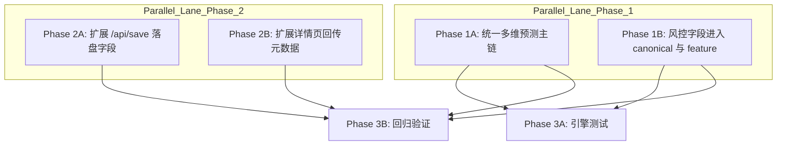

# 依赖图

```mermaid
flowchart TD
    A[Phase 1A: 统一多维预测主链]
    B[Phase 1B: 风控字段进入 canonical 与 feature]
    C[Phase 2A: 扩展 /api/save 落盘字段]
    D[Phase 2B: 扩展详情页回传元数据]
    E[Phase 3A: 引擎测试]
    F[Phase 3B: 回归验证]

    A --> E
    B --> E
    C --> F
    D --> F
    A --> F
    B --> F

    subgraph Parallel_Lane_Phase_1
        A
        B
    end

    subgraph Parallel_Lane_Phase_2
        C
        D
    end
```
