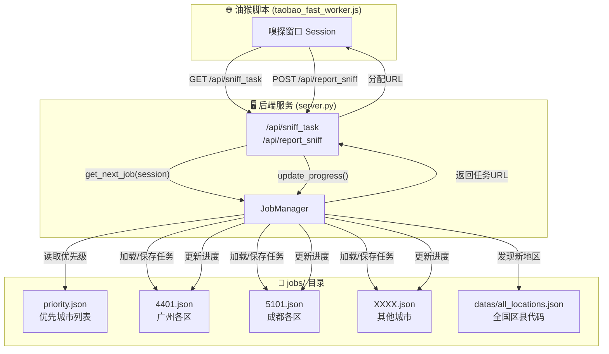
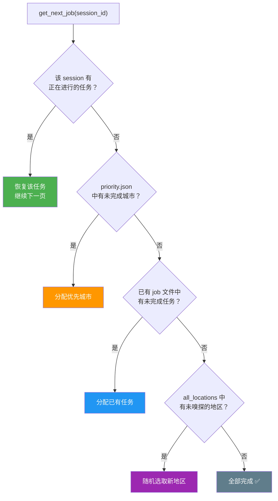
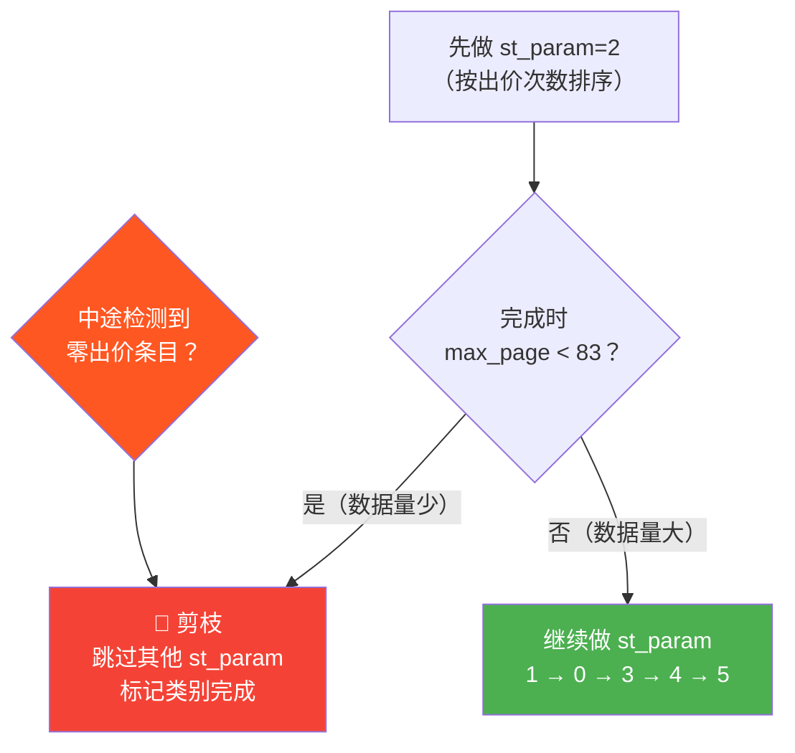

# Job Manager 架构说明

## 整体流程



## 任务分配优先级



## 排序参数剪枝策略

每个地区 × 类别需要嗅探多种排序方式（`st_param`），核心优化逻辑：



## 数据文件结构

每个 job 文件以城市代码前4位命名（如 `4401.json` = 广州市），内部按区县 → 类别 → 排序方式三层嵌套：

```
4401.json
├── all_done: false              # 整个文件是否完成
├── "440106"                     # 天河区
│   ├── "50025969" (住宅用房)
│   │   ├── now_session_id       # 当前占用的 session
│   │   ├── all_done             # 该类别是否完成
│   │   ├── last_update_time     # 最后更新时间
│   │   └── st_param
│   │       ├── "2": { pages: [1,2,...32], max_page: 96, is_done: false }
│   │       ├── "1": { pages: [], max_page: -1, is_done: false }
│   │       └── ...
│   └── "200782003" (商业用房)
│       └── ...同上结构
├── "440111"                     # 白云区
│   └── ...
└── ...
```

## Session 管理

| 机制 | 说明 |
|------|------|
| **会话绑定** | 每个类别任务通过 `now_session_id` 绑定到特定嗅探窗口 |
| **超时释放** | 60秒无更新自动释放，允许其他 session 接管 |
| **手动释放** | `release_session()` 用于窗口关闭时清理占用 |
| **断点续传** | session 重连后自动恢复到上次的页码继续 |

## 文件清单

| 文件 | 用途 |
|------|------|
| `job_manager.py` | 核心管理器，提供任务分配/进度更新/剪枝 |
| `priority.json` | 优先嗅探的城市代码列表 |
| `XXXX.json` | 各城市任务进度数据（按前4位市级代码分文件） |
