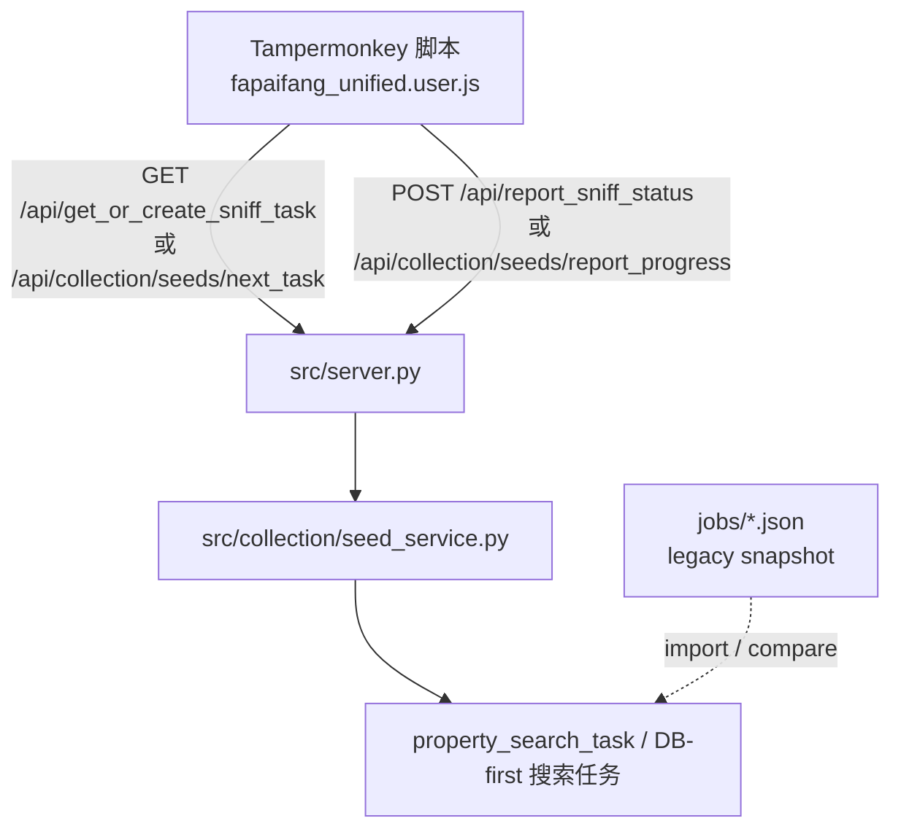

# jobs/ 目录说明

> ⚠️ 当前这是 **legacy 搜索任务文件体系目录**。
> 运行态主链已经逐步切到数据库中的 `property_search_task`，本目录现在主要用于：
>
> 1. 历史 `jobs/*.json` 快照保留
> 2. 离线对照 / 调试
> 3. 旧任务文件导入数据库

正式迁移与现网入口见：

- `src/collection/search_bootstrap.py`
- `tools/import_search_jobs_to_db.py`
- `src/storage/repository.py`

---

## 当前它在整体系统中的位置


```mermaid
graph TD
    TM["Tampermonkey 脚本<br/>fapaifang_unified.user.js"]
    API["src/server.py"]
    SEED["src/collection/seed_service.py"]
    DB["property_search_task / DB-first 搜索任务"]
    JOBS["jobs/*.json<br/>legacy snapshot"]

    TM -->|"GET /api/get_or_create_sniff_task<br/>或 /api/collection/seeds/next_task"| API
    TM -->|"POST /api/report_sniff_status<br/>或 /api/collection/seeds/report_progress"| API
    API --> SEED
    SEED --> DB
    JOBS -. import / compare .-> DB
```

也就是说：

- **运行态分配** 主要不再直接依赖 `jobs/*.json`
- **legacy jobs 文件** 主要作为导入源和历史快照存在

---

## 仍然保留的 legacy 逻辑

`jobs/job_manager.py` 仍然存在，并保留：

- 优先城市文件读取
- 旧 `jobs/*.json` 结构扫描
- sort_param / category / location 粒度的旧式调度逻辑
- session / page progress 的旧式恢复逻辑

但它的定位已经是：

> **历史任务体系的参考实现与离线迁移工具**
> 而不是当前现网调度的唯一真相来源。

---

## 当前相关接口名（已与旧文档不同）

旧文档中的：

- `/api/sniff_task`
- `/api/report_sniff`

已不应再作为主入口使用。

当前相关主接口应理解为：

- `GET /api/get_or_create_sniff_task`
- `GET /api/collection/seeds/next_task`
- `POST /api/report_sniff_status`
- `POST /api/collection/seeds/report_progress`

浏览器脚本当前也已统一为：

- `tampermonkey_scripts/fapaifang_unified.user.js`

---

## jobs/ 目录内文件用途

### 1. `priority.json`

历史优先城市列表，用于旧任务体系。

### 2. `XXXX.json`

按城市前缀拆分的历史任务进度快照，主要用于：

- 迁移前历史保留
- 导入 DB 时回放
- 旧任务状态抽样核对

### 3. `job_manager.py`

legacy 任务管理器实现。
它仍有参考价值，但不应被误读成“当前线上唯一任务调度主链”。

---

## 当前推荐的使用方式

### 1. 需要把旧 jobs 文件导入数据库时

使用：

```powershell
python tools/import_search_jobs_to_db.py
```

### 2. 需要让系统在 DB 中补建搜索任务时

优先看：

- `src/collection/search_bootstrap.py`

### 3. 需要理解当前搜索任务运行态时

优先看：

- `src/collection/seed_service.py`
- `src/storage/repository.py`
- `src/server.py`

而不是只盯着 `jobs/job_manager.py`

---

## 当前边界

本目录仍然有价值，但价值主要在：

- **迁移**
- **回放**
- **对照**
- **历史理解**

而不是当前生产调度主线本身。
